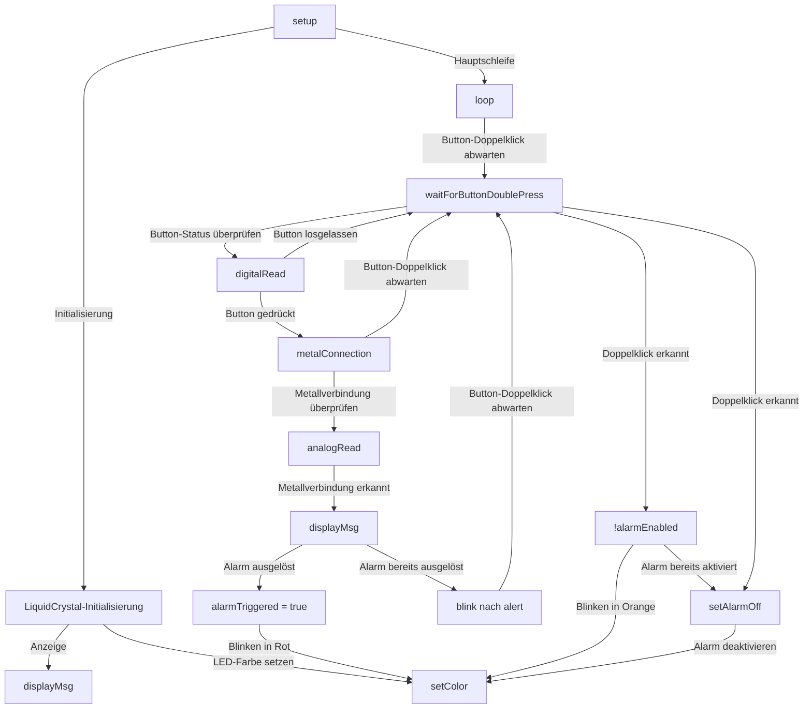
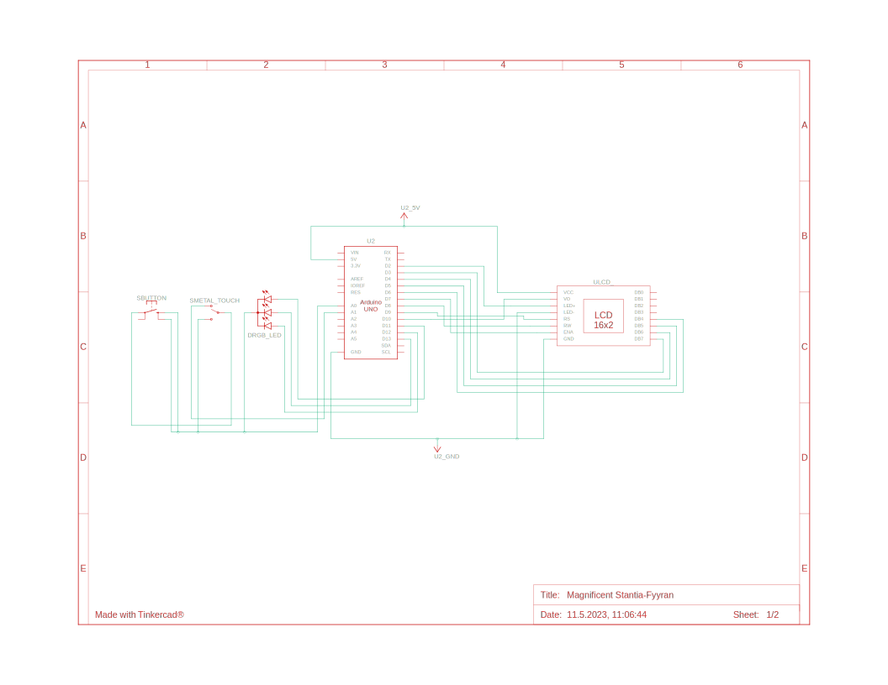
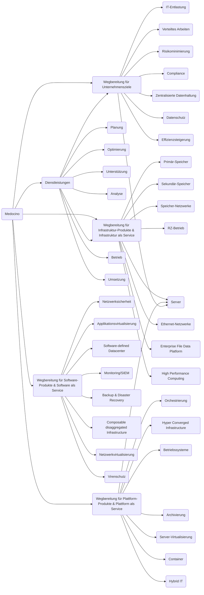

# Arduino Alarmanlage

<br />
<div align="center">
  <a href="https://github.com/noahzmr/arduino-alarmanlage">
    
  </a>

  <h3 align="center">Arduino Alarmanlage</h3>

  <p align="center">
    A little inspiration for people who want to start with Arduino!
    <br />
    <a href="https://github.com/noahzmr/arduino-alarmanlage"><strong>Explore the docs »</strong></a>
    <br />
    <br />
    <a href="https://github.com/noahzmr/arduino-alarmanlage/issues">Report Bug</a>
    ·
    <a href="https://github.com/noahzmr/arduino-alarmanlage/discussions">Request Feature</a>
  </p>
</div>

<details>
  <summary>Table of Contents</summary>
  <ol>
    <li>
      <a href="#introduction">Introduction</a>
      <ul>
        <li><a href="#built-with">Built With</a></li>
      </ul>
    </li>
    <li><a href="#anforderungen-und-komponenten">Anforderungen und Komponenten</a>
      <ul>
        <li><a href="#verbindung-von-arduino-und-raspberry-pi">Verbindung von Arduino und Raspberry Pi</a></li>
        <li><a href="#herunterladen-der-arduino-ide">Herunterladen der Arduino IDE</a></li>
      </ul>
    </li>
    <li><a href="#code">Code</a>
        <ul>
            <li><a href="#setup-funktion">Setup-Funktion</a></li>
            <li><a href="#loop-funktion">Loop-Funktion</a></li>
            <li><a href="#displaymsg-funktion">displayMsg-Funktion</a></li>
            <li><a href="#setcolor-funktion">setColor-Funktion</a></li>
            <li><a href="#blink-funktion">blink-Funktion</a></li>
            <li><a href="#waitforbuttondoublepress-funktion">waitForButtonDoublePress-Funktion</a></li>
            <li><a href="#setalarmon-funktion">setAlarmOn-Funktion</a></li>
            <li><a href="#setalarmoff-funktion">setAlarmOff-Funktion</a></li>
            <li><a href="#metalconnection-funktion">metalConnection-Funktion</a></li>
        </ul>
    </li>
    <li><a href="architecture">Architecture</a>
        <ul>
            <li><a href="#verkabelung">Verkabelung</a></li>
            <li><a href="#elektronische-schaltkreis">Elektronische Schaltkreis</a></li>
        </ul>
    </li>
    <li><a href="#ideen-fuers-weitermachen">Ideen fürs Weitermachen</a></li>
    <li><a href="#contact">Contact</a></li>
    <li><a href="#die-medocino">Die medocino</a></li>
    <li><a href="#support">Support</a></li>
    <li><a href="#lizenz">Lizenz</a></li>
  </ol>
</details>

## Einleitung

Willkommen bei dem Arduino-Alarmanlagen-Projekts, das sich rund um die Simulation einer Alarmanlage dreht. Dieses Projekt wurde entwickelt, um Einsteigern einen faszinierenden Einblick in die Welt des Arduino zu ermöglichen. Hierbei nutzen wir die Leistungsfähigkeit des Arduino-Mikrocontrollers, um eine interaktive und benutzerfreundliche Alarmanlage zu schaffen.

Dieses Projekt, das mit Unterstützung eines Praktikanten der 9. Klasse bei der medocino Hamburg GmbH entstanden ist, bietet Ihnen eine großartige Gelegenheit, Ihre Fähigkeiten in der Hardwareprogrammierung und -integration zu erweitern, indem Sie praktische Erfahrungen sammeln. Durch die Schritt-für-Schritt-Anleitung und die detaillierten Erklärungen werden Sie in die Lage versetzt, die Grundlagen der Arduino-Programmierung zu erlernen und Ihr Verständnis für elektronische Komponenten und ihre Zusammenspiel zu vertiefen.

Diese Alarmanlage-Simulation wird Ihnen helfen, das Potenzial des Arduino-Mikrocontrollers voll auszuschöpfen, indem Sie verschiedene Sensoren und Aktoren verwenden. Sie werden lernen, wie man Bewegungssensoren und Türkontakte einsetzt, um Eindringlinge zu erkennen, und wie man einen Alarm auslöst, um auf mögliche Sicherheitsverletzungen aufmerksam zu machen.

Egal, ob Sie bereits Erfahrung mit Arduino haben oder ob Sie neu in der Welt der Mikrocontroller und der Elektronik sind, dieses Projekt ist ein idealer Einstiegspunkt. Es bietet Ihnen die Möglichkeit, Ihre Kreativität einzusetzen, eigene Ideen einzubringen und Ihr Wissen kontinuierlich zu erweitern.

Also lassen Sie uns gemeinsam in diese faszinierende Welt eintauchen und entdecken, wie wir mit Arduino eine beeindruckende Alarmanlage simulieren können!

### Built with

<div style='display: flex; flex-direction: row; justify-content: space-around; align-items: center;'>

[](https://www.arduino.cc/)
[](https://www.raspberrypi.org/)
[](https://www.elegoo.com/)
[](https://www.tinkercad.com/)
[](https://mermaid-js.github.io/mermaid/)

</div>

## Anforderungen und Komponenten

| Komponente          | Beschreibung                                                             |
| ------------------- | ------------------------------------------------------------------------ |
| Arduino Uno         | Mikrocontroller-Board als zentrale Steuereinheit des Projekts            |
| Raspberry Pi 4      | Single-Board-Computer zur Benutzeroberfläche und Kommunikation           |
| LCD1602             | 16x2-Zeichen-LCD-Display zur Anzeige von Informationen                   |
| Button              | Einfacher Taster als Benutzereingabe                                     |
| RGB LED             | Leuchtdiode zur visuellen Anzeige des Alarmanlagenzustands               |
| Metall-Touch-Sensor | Berührungsempfindlicher Sensor zur Erkennung von Sicherheitsverletzungen |

Die Sensoren sind alle in dem [ELEGOO Upgraded 37 in 1 Sensor Modules Kit](https://www.elegoo.com/en-de/products/elegoo-37-in-1-sensor-kit?gclid=Cj0KCQjwpPKiBhDvARIsACn-gzD1Z3hR3POKkLCtrBkvIGGlrAgRS2OStIZJ8L-IoUkdrRBwN_xvKvkaAqYoEALw_wcB)

### Verbindung von Arduino und Raspberry Pi

Um den Arduino mit dem Raspberry Pi zu verbinden, gehen Sie wie folgt vor:

<ol>
  <li>Verbinden Sie den USB-Anschluss des Arduino mit einem USB-Anschluss des Raspberry Pi. Dadurch wird die serielle Kommunikation zwischen den beiden Geräten hergestellt.</li>
  <li>Stellen Sie sicher, dass Sie die neueste Version der Arduino IDE auf Ihrem Raspberry Pi installiert haben. Die Arduino IDE ist die Entwicklungsumgebung, mit der Sie den Arduino programmieren können.</li>
  <li>Öffnen Sie die Arduino IDE auf Ihrem Raspberry Pi und navigieren Sie zu "Werkzeuge" > "Board" und wählen Sie "Arduino Uno" aus. Dadurch wird der Arduino Uno als Zielplattform für Ihre Programmierung festgelegt.</li>
  <li>Wählen Sie unter "Werkzeuge" > "Port" den entsprechenden seriellen Port aus, über den der Arduino mit dem Raspberry Pi verbunden ist.</li>
</ol>

### Herunterladen der Arduino IDE

Um die Arduino IDE herunterzuladen, folgen Sie diesen Schritten:

<ol>
  <li>Öffnen Sie einen Webbrowser auf Ihrem Computer und besuchen Sie die offizielle Arduino-Website (<a href="https://www.arduino.cc">https://www.arduino.cc</a>).</li>
  <li>Klicken Sie auf den Link "Software", um zur Download-Seite zu gelangen.</li>
  <li>Wählen Sie das Betriebssystem aus, das auf Ihrem Computer läuft (z. B. Windows, macOS oder Linux).</li>
  <li>Klicken Sie auf den Download-Link, um den Installationsprozess zu starten.</li>
  <li>Nach Abschluss des Downloads führen Sie die Installationsdatei aus und folgen Sie den Anweisungen auf dem Bildschirm, um die Arduino IDE auf Ihrem Computer zu installieren.</li>
</ol>

Nachdem wir nun einen Überblick über die Anforderungen und Komponenten erhalten haben, ist es an der Zeit, in den Coding-Teil einzusteigen. In diesem Abschnitt werden wir den Arduino-Code für die Alarmanlage genauer betrachten und Schritt für Schritt erklären. Du wirst lernen, wie die einzelnen Komponenten miteinander interagieren und wie der Code aufgebaut ist, um die gewünschte Funktionalität zu erreichen. Bist du bereit, tiefer in die Welt des Programmierens einzutauchen? Lass uns loslegen!

## Code

Um einen Arduino zu programmieren, benötigst du die C++-Programmiersprache in Verbindung mit der Arduino-Entwicklungsumgebung (IDE). Hier ist eine kurze Übersicht über die wichtigsten Konzepte und Funktionen in C++, die für die Arduino-Programmierung relevant sind:

| Konzept                    | Beschreibung                                                                                 |
| -------------------------- | -------------------------------------------------------------------------------------------- |
| Hauptfunktion              | Die `setup`-Funktion, in der Initialisierungen durchgeführt werden.                          |
| Schleifenfunktion          | Die `loop`-Funktion, die den Hauptteil des Programms enthält und wiederholt ausgeführt wird. |
| Pin-Modi                   | Festlegung des Modus der digitalen Pins (INPUT oder OUTPUT).                                 |
| Digitale Ein- und Ausgänge | Lesen (digitalRead) und Schreiben (digitalWrite) von digitalen Pins.                         |
| Analoge Ein- und Ausgänge  | Lesen (analogRead) und Schreiben (analogWrite) von analogen Werten.                          |
| Bibliotheken               | Erweiterung der Funktionalität durch das Einbinden von Bibliotheken.                         |
| Serielle Kommunikation     | Kommunikation mit dem Computer über eine serielle Verbindung (Serial).                       |

Dies ist nur eine grundlegende Übersicht über die wichtigsten Aspekte der C++-Programmierung für den Arduino. Es gibt noch viele weitere fortgeschrittene Konzepte und Funktionen, die du erkunden kannst, je nachdem, was du mit deinem Arduino-Projekt erreichen möchtest. Die Arduino-Website bietet umfangreiche Ressourcen und Beispiele, um dir den Einstieg zu erleichtern.

| Befehl          | Beschreibung                                                                                             |
| --------------- | -------------------------------------------------------------------------------------------------------- |
| `const int`     | Deklaration einer konstanten Ganzzahl.                                                                   |
| `#include`      | Einbinden einer Bibliothek oder Header-Datei.                                                            |
| `#define`       | Definition eines Makros zur Textersetzung.                                                               |
| `bool`          | Datentyp für boolesche Werte (Wahr/Falsch).                                                              |
| `void`          | Rückgabetyp einer Funktion, die keinen Wert zurückgibt.                                                  |
| `pinMode`       | Festlegung des Modus eines Pins (INPUT, OUTPUT, INPUT_PULLUP).                                           |
| `analogWrite`   | Ausgabe eines analogen Signals auf einem Pin.                                                            |
| `delay`         | Verzögerung der Programmausführung für eine bestimmte Anzahl von Millisekunden.                          |
| `unsigned long` | Vorzeichenloser ganzzahliger Datentyp für große Zahlen.                                                  |
| `millis()`      | Funktion, die die vergangene Zeit in Millisekunden seit dem Start des Programms zurückgibt.              |
| `Serial`        | Objekt für die serielle Kommunikation mit dem Computer.                                                  |
| `println`       | Ausgabe von Text oder Werten über die serielle Schnittstelle, gefolgt von einem Zeilenumbruch (newline). |

Im Folgenden wird der Code der Anwendung präsentiert, und vorab ist das Abhängigkeitsdiagramm, das den Ablauf und die Interaktionen der verschiedenen Funktionen veranschaulicht. Der Code ist in logische Abschnitte unterteilt und wird jeweils erläutert, um das Verständnis zu erleichtern.

Das Abhängigkeitsdiagramm zeigt die Zusammenhänge und Interaktionen der verschiedenen Funktionen innerhalb der Alarmanlagenanwendung. Es vermittelt einen Überblick über den Programmfluss und hilft dabei, die Beziehungen zwischen den Funktionen zu verstehen.

Der Code ist in logische Abschnitte unterteilt und wird ausführlich erläutert, um das Verständnis zu erleichtern. Jeder Abschnitt behandelt einen bestimmten Aspekt der Alarmanlage, von der Initialisierung bis zur Behandlung von Alarmereignissen.

Bitte beachten Sie, dass der Code als Referenz und Lehrzwecken dient. Sie können ihn für Ihre eigenen Projekte anpassen und erweitern.



### Variablen und Bibliotheken

```ino
#include <LiquidCrystal.h>

const int rs = 9, en = 7, d4 = 6, d5 = 5, d6 = 4, d7 = 3, v0 = 10, a = 2, rw = 8;
const int buttonPin = A0;
const int touchPin = A1;
bool alarmEnabled = false;
bool alarmTriggered = false;

LiquidCrystal lcd(rs, rw, en, d4, d5, d6, d7);
```

- Die Bibliothek `LiquidCrystal` wird für die Steuerung des LCD-Displays verwendet.
- Die konstanten Variablen `rs`, `en`, `d4`, `d5`, `d6`, `d7`, `v0`, `a` und `rw` werden verwendet, um die verwendeten Pins für das LCD und andere Komponenten festzulegen.
- `buttonPin` und `touchPin` definieren die Pins, an denen die Taster bzw. der Touch-Sensor angeschlossen sind.
- `alarmEnabled` und `alarmTriggered` sind boolesche Variablen, die den Status der Alarmanlage speichern.
- Das Objekt `lcd` wird erstellt, um die LiquidCrystal-Bibliothek zu verwenden.

### Setup-Funktion

Die setup()-Funktion wird einmal beim Start des Programms aufgerufen und initialisiert die erforderlichen Einstellungen:

```ino
void setup()
{
  Serial.begin(9600);
  pinMode(touchPin, INPUT);
  lcd.begin(16, 2);
  pinMode(v0, OUTPUT);
  analogWrite(v0, 100);
  pinMode(a, OUTPUT);
  analogWrite(a, 128);
  pinMode(buttonPin, INPUT_PULLUP);
  pinMode(11, OUTPUT);
  pinMode(10, OUTPUT);
  pinMode(9, OUTPUT);
  setColor(0, 255, 0);
  lcd.setCursor(0, 0);
  lcd.print("Alarmanlage");
  displayMsg("Unscharf");
}
```

- `Serial.begin(9600)` initialisiert die serielle Kommunikation mit einer Baudrate von 9600.
- `pinMode(touchPin, INPUT)` legt den Modus des Touch-Pins als Eingang fest.
- `lcd.begin(16, 2)` initialisiert das LCD-Display mit 16 Zeichen pro Zeile und 2 Zeilen.
- `pinMode(v0, OUTPUT)` und `analogWrite(v0, 100)` stellen den Ausgangsmodus und den Ausgangswert des Pins v0 ein.
- `pinMode(a, OUTPUT)` und `analogWrite(a, 128)` stellen den Ausgangsmodus und den Ausgangswert des Pins a ein.
- `pinMode(buttonPin, INPUT_PULLUP)` legt den Modus des Taster-Pins als Eingang mit Pull-Up-Widerstand fest.
- `pinMode(11, OUTPUT)`, `pinMode(10, OUTPUT)` und `pinMode(9, OUTPUT)` legen die Modi der Pins 11, 10 und 9 als Ausgang fest.
- `setColor(0, 255, 0)` ruft die Funktion `setColor()` auf und setzt die Farbe des RGB-LEDs auf Grün.
- `lcd.setCursor(0, 0)` positioniert den Cursor auf der ersten Zeile und ersten Spalte des LCD-Displays.
- `lcd.print("Alarmanlage")` gibt den Text "Alarmanlage" auf dem LCD-Display aus.
- `displayMsg("Unscharf")` ruft die Funktion `displayMsg()` auf, um die Nachricht "Unscharf" auf der zweiten Zeile des LCD-Displays und über die serielle Kommunikation anzuzeigen.

### Loop-Funktion

Die `loop()`-Funktion wird kontinuierlich ausgeführt, nachdem die setup()-Funktion abgeschlossen ist:

```ino
void loop()
{
  waitForButtonDoublePress();
}
```

Die `loop()`-Funktion ruft die Funktion `waitForButtonDoublePress()` auf. Diese Funktion wird verwendet, um auf einen doppelten Tastendruck zu warten und entsprechende Aktionen auszuführen.

### displayMsg-Funktion

Die `displayMsg()`-Funktion dient zum Anzeigen einer Nachricht auf dem LCD-Display und über die serielle Kommunikation:

```ino
void displayMsg(const char *msg)
{
  lcd.setCursor(0, 1);
  lcd.print(msg);
  Serial.println(msg);
  delay(50);
}
```

- `lcd.setCursor(0, 1)` positioniert den Cursor auf der zweiten Zeile und ersten Spalte des LCD-Displays.
- `lcd.print(msg)` gibt die übergebene Nachricht auf dem LCD-Display aus.
- `Serial.println(msg)` sendet die Nachricht über die serielle Kommunikation.
- `delay(50)` fügt eine kleine Verzögerung hinzu, um eine flüssige Anzeige zu gewährleisten.

### setColor-Funktion

Die `setColor()`-Funktion steuert die Farbe des RGB-LEDs:

```ino
void setColor(int red, int green, int blue)
{
  analogWrite(13, red);
  analogWrite(12, green);
  analogWrite(11, blue);
}
```

`analogWrite(pin, value)` setzt den angegebenen Pin auf den angegebenen PWM-Wert (Pulsweitenmodulation). Hierbei werden die Pins 13, 12 und 11 verwendet, um die rote, grüne und blaue Farbkomponente des RGB-LEDs zu steuern.

### blink-Funktion

Die `blink()`-Funktion steuert das Blinken des RGB-LEDs und enthält auch eine Funktionalität für einen doppelten Tastendruck:

### waitForButtonDoublePress-Funktion

Die `waitForButtonDoublePress()`-Funktion wartet auf einen doppelten Tastendruck und führt entsprechende Aktionen aus:

```ino
void waitForButtonDoublePress()
{
  int buttonCount = 0;
  int buttonState = HIGH;
  Serial.print("Wait for button up: ");
  while (digitalRead(buttonPin) != HIGH)
  {
    Serial.print(".");
    delay(50);
  }
  Serial.print("\nStart wait for Click: ");
  while (buttonCount < 2)
  {
    buttonState = digitalRead(buttonPin);
    if (buttonState == HIGH)
    {
      Serial.print("~");
      while (digitalRead(buttonPin) != LOW)
      {
        if (alarmEnabled)
        {
          metalConnection();
        }
        delay(50);
      }
      buttonCount++;
      delay(250);
      Serial.print("+");
    }
    delay(50);
  }
  Serial.print("\n");

  if (buttonCount == 2)
  {
    Serial.print("Double Click!\n");
    if (!alarmEnabled)
    {
      blink("orange");
    }
    else
    {
      setAlarmOff();
    }
  }
  buttonCount = 0;
}
```

Die Funktion überprüft den Status des Taster-Pins, um einen Tastendruck zu erfassen und auf einen doppelten Tastendruck zu warten.
Sobald ein doppelter Tastendruck erkannt wird, werden entsprechende Aktionen ausgeführt, z. B. das Aufrufen der `blink()`-Funktion oder das Deaktivieren des Alarms.

### setAlarmOn-Funktion

Die `setAlarmOn()`-Funktion aktiviert den Alarm:

```ino
void setAlarmOn()
{
  setColor(255, 0, 0);
  displayMsg("Aktiv");
  Serial.print("setAlarmOn\n");
  alarmEnabled = true;
}
```

Die Funktion ändert die Farbe des RGB-LEDs in Rot, zeigt die Nachricht "Aktiv" auf dem LCD-Display an und aktiviert den Alarm.

### setAlarmOff-Funktion

Die `setAlarmOff()`-Funktion deaktiviert den Alarm:

```ino
void setAlarmOff()
{
  setColor(0, 255, 0);
  displayMsg("Inaktiv");
  Serial.print("setAlarmOff\n");
  alarmEnabled = false;
  alarmTriggered = false;
}
```

- Die Funktion ändert die Farbe des RGB-LEDs in Grün, zeigt die Nachricht "Inaktiv" auf dem LCD-Display an, deaktiviert den Alarm und setzt den Alarmauslösestatus zurück.

### metalConnection-Funktion

Die `metalConnection()`-Funktion überwacht die Verbindung zu einem Metallsensor und löst bei Bedarf den Alarm aus:

```ino
void metalConnection()
{

  int sensorValue = analogRead(touchPin);
  if (alarmEnabled)
  {
    Serial.print("\nStart wait for action: ");
    if (sensorValue < 1023)
    {
    }
    else
    {
      displayMsg("ALARM");
      if (alarmTriggered)
      {
        Serial.println("TRIGEERD THE ALERT");
        Serial.println(sensorValue);
        blink("alert");
      }
      else
      {
        Serial.println("Countdown for shutdown");
        Serial.println(sensorValue);
        alarmTriggered = true;
        blink("red");
      }
      unsigned long startTime = millis();
      while (millis() - startTime < 30000)
      {
        waitForButtonDoublePress();
      }
    }
  }
}
```

## Architecture

### Verkabelung

Neben dem Code und dem Abhängigkeitsdiagramm möchten wir Ihnen auch die Verkabelung der Alarmanlage präsentieren. In diesem Abschnitt finden Sie eine Skizze der Verkabelung, erstellt mit Tinkercad, sowie das tatsächliche Ergebnis in der Realität.

Nachdem Sie die Verkabelung anhand der Skizze durchgeführt haben, präsentieren wir Ihnen das tatsächliche Ergebnis der Alarmanlage in der Realität. Die Komponenten sind entsprechend der Verkabelungsskizze miteinander verbunden und einsatzbereit. Sie können das reale Ergebnis als visuelle Referenz für Ihre eigene Alarmanlage nutzen.


### Elektronische Schaltkreis

Die folgende Schaltplan-Skizze zeigt den elektronischen Schaltkreis der Arduino-Alarmanlage. Sie wurde mit Tinkercad erstellt und bietet Ihnen einen übersichtlichen Blick auf die Verbindungen zwischen den Komponenten. Der Schaltplan dient als Referenz für den Aufbau Ihrer eigenen Alarmanlage.



## Ideen fürs Weitermachen

Nachdem du ein Tutorial abgeschlossen hast und grundlegende Kenntnisse erworben hast, gibt es verschiedene Möglichkeiten, dein Projekt weiterzuentwickeln. Hier sind einige Schritte, die du in Betracht ziehen könntest:

1. API-Nutzung: Zum Beispiel kannst du die Hue API nutzen, um zusätzliche Lichter zu steuern, Farben zu ändern oder komplexe Aktionen wie das Blinken der Lichter während eines Alarms umzusetzen. Ein Beispiel wie man die Hue Api nutz findest du bei einem anderen von meinen [](https://github.com/noahzmr/hue_outlook_sync).

2. Web UI: Erstelle eine benutzerfreundliche Web-Oberfläche, um die Steuerung und Konfiguration deines Projekts über einen Browser zu ermöglichen. Du kannst HTML, CSS und JavaScript verwenden, um das Front-End zu gestalten und mit der API zu kommunizieren.
   Beispiele wie man eine UI mit React bauen kann und sie auf einen ExpressJS server hosten kann kannst du auf [](https://github.com/noahzmr/hue_outlook_sync) Seite finden.

3. Smartphone-App: Entwickle eine native App für iOS oder Android, um dein Projekt über das Smartphone zu steuern. Du kannst eine plattformübergreifende Framework wie React Native oder Flutter verwenden oder dich für eine native Entwicklung mit Swift (iOS) oder Kotlin/Java (Android) entscheiden.

4. Sensoren erweitern: Erkunde verschiedene Sensoren, die du in dein Projekt integrieren kannst, um zusätzliche Daten zu sammeln oder die Interaktion mit der Umgebung zu verbessern. Du könntest beispielsweise Bewegungssensoren, Temperatur- und Feuchtigkeitssensoren, Lichtsensoren oder Beschleunigungssensoren hinzufügen.
   Ein Beispiel wie man ein Arduino mit einem Raspberry Pi zusammen nutzen kann kannst du [](https://github.com/noahzmr/scooter-app) finden.

5. Erweiterungen und Verbesserungen: Experimentiere mit neuen Funktionen und Verbesserungen für dein Projekt. Du könntest beispielsweise eine Zeitschaltuhr hinzufügen, um die Lichter zu bestimmten Zeiten automatisch ein- und auszuschalten, oder Benachrichtigungen über Ereignisse per E-Mail oder SMS versenden.
   Wenn es ums Thema benachrichtung geht könnte die [](https://github.com/noahzmr/scooter-app) interessant sein.

6. Dokumentation und Teilen: Dokumentiere deine Fortschritte und teile dein Projekt mit der Community. Du kannst einen Blog schreiben, ein Video-Tutorial erstellen oder dein Projekt auf Plattformen wie GitHub oder Instructables veröffentlichen, um anderen bei ähnlichen Projekten zu helfen oder Feedback zu erhalten.

Diese Schritte dienen als Anregung für das weitere Vorgehen nach Abschluss eines Tutorials. Du kannst sie an deine spezifischen Anforderungen und Interessen anpassen, um dein Projekt weiterzuentwickeln und neue Funktionen hinzuzufügen.

## Contact

Hier finden Sie alle notwendigen Informationen, um weitere Informationen über mich zu erhalten oder um Kontakt aufzunehmen. Wenn Sie Fragen zu diesem Projekt haben, nutzen Sie gerne den [](https://github.com/noahzmr/arduino-alarmanlage/discussions) Teil.

<div style='display: flex; flex-direction: row; justify-content: space-around; align-items: center;'>

<div>

[](https://www.xing.com/profile/NoahDanyael_Zeumer/)

[](https://www.linkedin.com/in/noah-zeumer-34b5081a5/?originalSubdomain=de)

[](mailto:noah@noerkelit.online)

</div>

<a href='https://taag.co/GxxtAjXSpr1679622602xuDhbkVpDX' target="_blank"></a>

</div>

## Die medocino

<div style='display: flex; flex-direction: row; justify-content: space-around; align-items: center;'>
  <a href='https://medocino.net/' target="_blank"></a>
</div>

Die medocino Hamburg GmbH ist ein erfahrenes Systemhaus und IT-Dienstleister, das sich auf den Aufbau und die Betreuung von IT-Infrastrukturen spezialisiert hat. Mit einem Team engagierter IT-Experten bieten wir umfassende Dienstleistungen und maßgeschneiderte Lösungen für namhafte Konzerne, mittelständische Unternehmen und Start-ups.

Unsere Kunden schätzen unsere Fachkompetenz, Erfahrung und Leidenschaft für IT. Wir verstehen IT als solides Handwerk und bieten individuelle Lösungen, die auf die spezifischen Anforderungen jedes Unternehmens zugeschnitten sind. Dabei setzen wir auf zuverlässige Technologien, innovative Ansätze und bewährte Methoden.

Als medocino Gruppe bieten wir eine ganzheitliche Betreuung und stehen unseren Kunden als verlässlicher Partner zur Seite. Unser Team besteht aus hochqualifizierten Mitarbeitern, die nicht nur technisch versiert sind, sondern auch eine hohe Kundenorientierung mitbringen.

Aber nicht nur als Dienstleister sind wir tätig, sondern auch als Ausbildungsbetrieb für angehende Fachinformatiker Systemintegration. Ich spreche aus Erfahrung, da ich aktuell eine Ausbildung bei der medocino absolviere und Teil des Teams bin. Bei uns hast du die Möglichkeit, eine Ausbildung im IT-Bereich zu absolvieren und ebenfalls Teil unseres Teams zu werden. Ich kann aus eigener Erfahrung sagen, dass wir großen Wert auf eine fundierte Ausbildung legen und dir die Chance bieten, praktische Erfahrungen zu sammeln und dich fachlich weiterzuentwickeln.

Unser Ziel ist es, die IT-Infrastruktur unserer Kunden zu optimieren, Prozesse zu verbessern und echten Mehrwert zu schaffen. Wir bieten umfangreiche Leistungen in den Bereichen Speichertechnologie, Infrastruktur-Automatisierung, Hochverfügbarkeitslösungen und Rechenzentrums-Dienstleistungen.

Vertrauen Sie auf die medocino Gruppe, um Ihre IT-Herausforderungen zu bewältigen und Ihr Unternehmen erfolgreich voranzubringen. Kontaktieren Sie uns noch heute und erfahren Sie, wie wir Ihnen helfen können.

Im Folgenden präsentieren ich Ihnen einen grafischen Überblick über die vielfältigen Dienstleistungen, die die medocino Hamburg GmbH anbietet.



Ich bin unglaublich dankbar, dass ich die Möglichkeit habe, meine Ausbildung bei Medocino zu absolvieren. Hier bekomme ich nicht nur die Chance, mich mit den klassischen Aufgaben der Systemintegration vertraut zu machen, sondern auch Einblicke in die spannenden Bereiche der Softwareentwicklung und der IT-Sicherheit zu erhalten.

Was das Arbeiten hier besonders bereichernd macht, ist die Vielfalt an Services, die mir zur Verfügung stehen. Ich kann beispielsweise auf Tools wie Sentry, GitLab und SonarQube zugreifen, um meine Arbeit zu optimieren und qualitativ hochwertige Lösungen zu entwickeln. Diese Ressourcen ermöglichen es mir, meine Fähigkeiten weiterzuentwickeln und mich kontinuierlich in meinem Fachgebiet zu verbessern.

Ich bin gespannt, welche spannenden Projekte und Herausforderungen noch auf mich warten und freue mich, Teil des Medocino-Teams zu sein.

## Support

Wenn du meine Arbeit unterstützen möchtest, kannst du mir gerne eine Tasse Kaffee spendieren. Besuche dazu einfach meine [](https://www.buymeacoffee.com/noahdnylzmr)
und gib einen Betrag deiner Wahl ein. Ich bin dankbar für jede Unterstützung.
Vielen Dank im Voraus!

## Lizenz

Dieses Projekt ist lizenziert unter der [BSD 2-Clause License](https://github.com/noahzmr/arduino-alarmanlage/blob/main/LICENSE.md). Bitte beachten Sie die Bedingungen und Bestimmungen dieser Lizenz.
